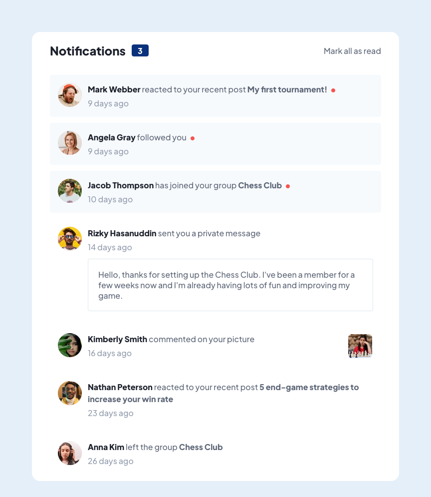

# Frontend Mentor - Notifications page solution

This is a solution to the [Notifications page challenge on Frontend Mentor](https://www.frontendmentor.io/challenges/notifications-page-DqK5QAmKbC). Frontend Mentor challenges help you improve your coding skills by building realistic projects.

## Table of contents

- [Frontend Mentor - Notifications page solution](#frontend-mentor---notifications-page-solution)
  - [Table of contents](#table-of-contents)
  - [Overview](#overview)
    - [The challenge](#the-challenge)
    - [Screenshot](#screenshot)
    - [Links](#links)
  - [My process](#my-process)
    - [Built with](#built-with)
  - [Author](#author)

## Overview

### The challenge

Users should be able to:

- Distinguish between "unread" and "read" notifications
- Select "Mark all as read" to toggle the visual state of the unread notifications and set the number of unread messages to zero
- View the optimal layout for the interface depending on their device's screen size
- See hover and focus states for all interactive elements on the page

### Screenshot

### Links

- Solution URL: [https://github.com/abizmo/notifications-page](https://github.com/abizmo/notifications-page)
- Live Site URL: [https://abizmo.github.io/notifications-page/](https://abizmo.github.io/notifications-page/)

## My process

### Built with

- Semantic HTML5 markup
- CSS custom properties
- Mobile-first workflow
- [React](https://reactjs.org/) - JS library
- [React-testing-library](https://testing-library.com/docs/react-testing-library/intro/) - Is a very light-weight solution for testing React components.
- [Storybook](https://storybook.js.org/) - A tool for UI development.
- [Vite](https://vitejs.dev/) - A build tool for modern web projects.
- [Vitest](https://vitest.dev/) - A Vite-native unit test framework.

## Author

- Website - [Abián Izquierdo](https://www.abizmo.dev)
- Frontend Mentor - [@abizmo](https://www.frontendmentor.io/profile/abizmo)
- Github - [@abizmo](https://www.github.com/abizmo)
